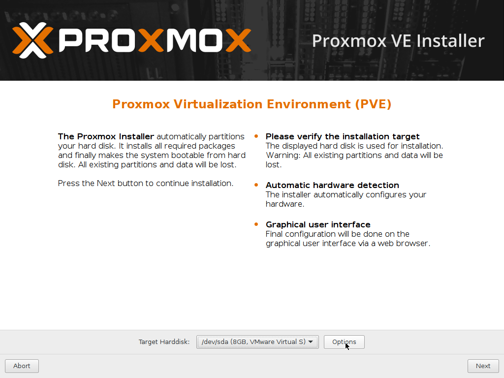

系統安裝(進階)
=

此為進階使用者的安裝方式，適合進階實務使用，請準備 2 個 USB3.0 的隨身碟，本例中將使用隨身碟作為 Raid1 的系統磁區。
此範例中硬碟分配為:
1. 2 個 8GB 硬碟(模擬為 USB3.0 隨身碟)
2. 1 個 16GB 硬碟(模擬為一般硬碟)


## 一、系統安裝

- 使用 **USB開機碟** 進行開機：

    
    <br><br>

- 同意使用條款

    
    <br><br>

- 點擊 **Options** ，這邊我們選用 zfs 作為 rootfs

    
    <br><br>

- 此範例中有 2 個隨身碟，選擇 zfs 的 Raid1 軟體陣列以確保資料安全

    
    <br><br>

- 壓縮模式選擇 **lz4** 較為快速，也吃比較少資源

    
    <br><br>

- 時區、國家、語言設定，通常只會修改時間跟國家的選項
    
    
    <br><br>

- 設定 root 的密碼以及管理者的 email 
    
    
    <br><br>

- 設定 IP，請依照主機的網路環境進行修改
    
    
    <br><br>

- 因為使用隨身碟，安裝系統可能需要一點時間
    
    
    <br><br>

- 安裝完畢，重新啟動
    
    
    <br><br>

## 二、 USB 優化

因為 Proxmox VE 內某些資料夾會經常讀取，隨身碟可能會不堪負荷，壽命減短，而且速度也不優，本例將以一個 16 GB 大小的 zpool 當作 HDD ，將以下資料夾掛載到 HDD pool 之中:

*Reference : [Proxmox VE 伺服器虛擬化管理平台 使用者社團](https://goo.gl/j4mTdx)*

``` swap ```
``` /var/lib/vz ```
``` /var/cache ```
``` /var/log ```

- 直接使用 SSH 連線進入 Proxmox VE 主機，使用```fdisk -l```查詢傳統硬碟 :
    
    ```
    root@pve:~# fdisk -l
    
    Disk /dev/sdc: 16 GiB, 17179869184 bytes, 33554432 sectors
    Units: sectors of 1 * 512 = 512 bytes
    Sector size (logical/physical): 512 bytes / 512 bytes
    I/O size (minimum/optimal): 512 bytes / 512 bytes
    Disk /dev/zd0: 896 MiB, 939524096 bytes, 1835008 sectors
    Units: sectors of 1 * 512 = 512 bytes
    Sector size (logical/physical): 512 bytes / 4096 bytes
    I/O size (minimum/optimal): 4096 bytes / 4096 bytes

    ```

- 建立 zpool :

    ```
    root@pve:~# zpool create HardDisk /dev/sdc

    root@pve:~# zpool status
      pool: HardDisk
     state: ONLINE
      scan: none requested
    config:

	        NAME        STATE     READ WRITE CKSUM
	        HardDisk    ONLINE       0     0     0
	        sdc       ONLINE       0     0     0

    errors: No known data errors

      pool: rpool
     state: ONLINE
      scan: none requested
    config:

	        NAME        STATE     READ WRITE CKSUM
	        rpool       ONLINE       0     0     0
	          mirror-0  ONLINE       0     0     0
	            sda2    ONLINE       0     0     0
	            sdb2    ONLINE       0     0     0

    errors: No known data errors
    ```

- 建立 dataset
    
    ```
    root@pve:~# zfs create HardDisk/cache
    root@pve:~# zfs create HardDisk/cache/vz
    root@pve:~# zfs create HardDisk/cache/cache
    root@pve:~# zfs create HardDisk/cache/log
    root@pve:~# zfs list 
    NAME                   USED  AVAIL  REFER  MOUNTPOINT
    HardDisk               166K  15.4G    19K  /HardDisk
    HardDisk/cache          95K  15.4G    19K  /HardDisk/cache
    HardDisk/cache/cache    19K  15.4G    19K  /HardDisk/cache/cache
    HardDisk/cache/log      19K  15.4G    19K  /HardDisk/cache/log
    HardDisk/cache/vz       19K  15.4G    19K  /HardDisk/cache/vz
    rpool                 1.63G  6.06G    96K  /rpool
    rpool/ROOT             714M  6.06G    96K  /rpool/ROOT
    rpool/ROOT/pve-1       714M  6.06G   714M  /
    rpool/data              96K  6.06G    96K  /rpool/data
    rpool/swap             953M  6.99G    64K  -
    ```

- 使用 zfs 建立 swap，容量依據自身需求調整
    
    ```
    root@pve:~# zfs create -V 8G HardDisk/swap
    root@pve:~# mkswap /dev/zvol/HardDisk/swap
    Setting up swapspace version 1, size = 8388604 KiB
    no label, UUID=9c239646-d67a-4ea6-b56a-aabc04ffb9c7
    ```

- 修改 ```/etc/fstab```，將原本在 USB 內的 swap 換成新的路徑
- 修改剛剛建立的 zfs 之掛載點
    - ```/var/lib/vz```
        
        清空該資料夾，這樣才有辦法修改掛載點，**記得備份**

        ```
        root@pve:~# rm -rf /var/lib/vz/*
        root@pve:~# zfs set mountpoint=/var/lib/vz HardDisk/cache/vz
        ```
    
    - ```/var/cache```
    
        清空該資料夾，這樣才有辦法修改掛載點
        
        ```
        root@pve:~# rm -rf /var/cache/*
        root@pve:~# zfs set mountpoint=/var/cache HardDisk/cache/cache
        ```
    
    - ```/var/log```
        
        清空該資料夾，這樣才有辦法修改掛載點
        
        ```
        root@pve:~# rm -rf /var/log/*
        root@pve:~# zfs set mountpoint=/var/log HardDisk/cache/log
        ```

    
- 重新啟動，成功移動常讀寫的資料夾到 HHD 中，記得把原本 rpool 內的 swap 刪掉

    ```
    root@pve:~# zfs list 
    NAME                   USED  AVAIL  REFER  MOUNTPOINT
    HardDisk              8.25G  7.13G    19K  /HardDisk
    HardDisk/cache         805K  7.13G    19K  /HardDisk/cache
    HardDisk/cache/cache    19K  7.13G    19K  /var/cache
    HardDisk/cache/log     748K  7.13G   748K  /var/log
    HardDisk/cache/vz       19K  7.13G    19K  /var/lib/vz
    HardDisk/swap         8.25G  15.4G    16K  -
    rpool                 1.63G  6.06G    96K  /rpool
    rpool/ROOT             710M  6.06G    96K  /rpool/ROOT
    rpool/ROOT/pve-1       710M  6.06G   710M  /
    rpool/data              96K  6.06G    96K  /rpool/data
    ```
