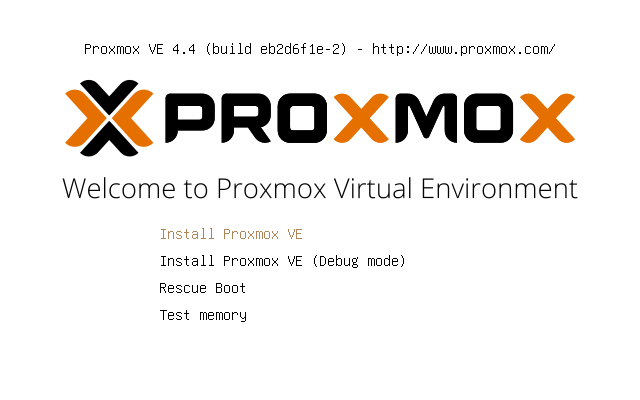
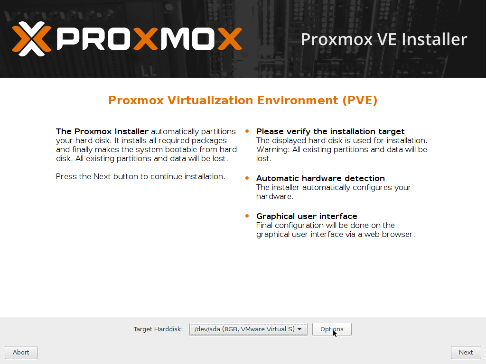
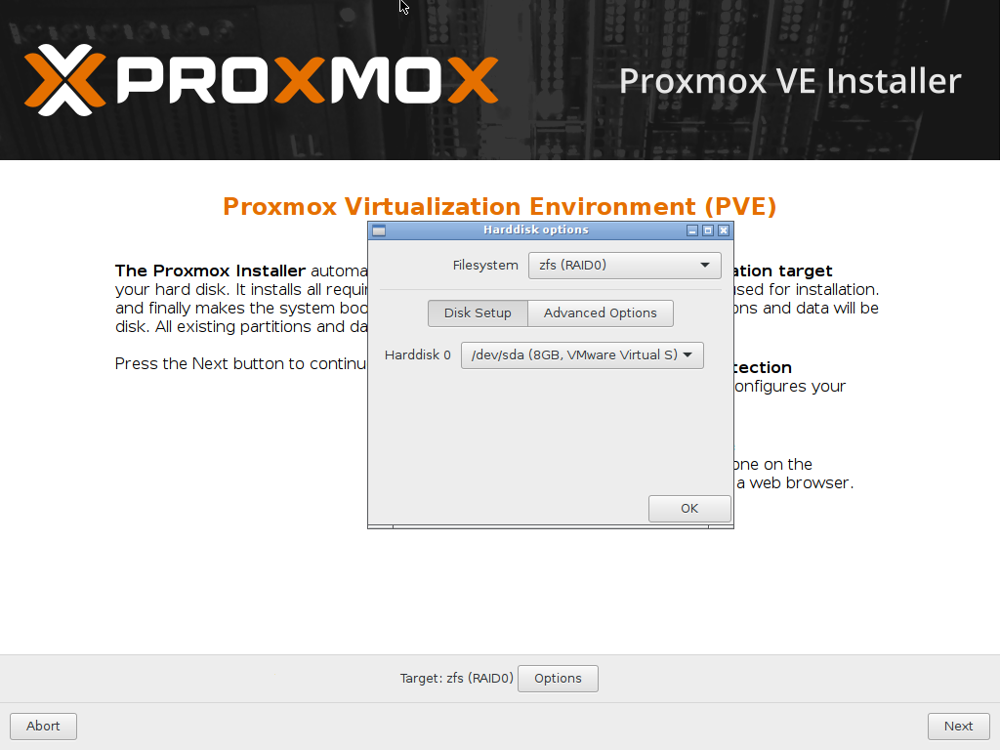
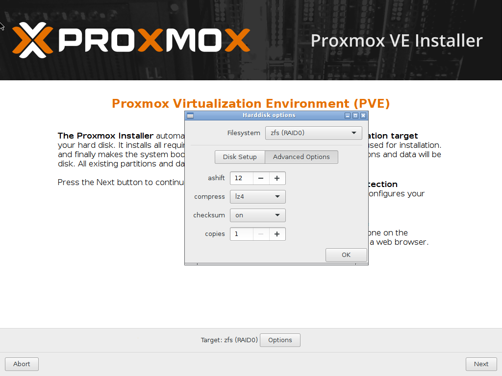
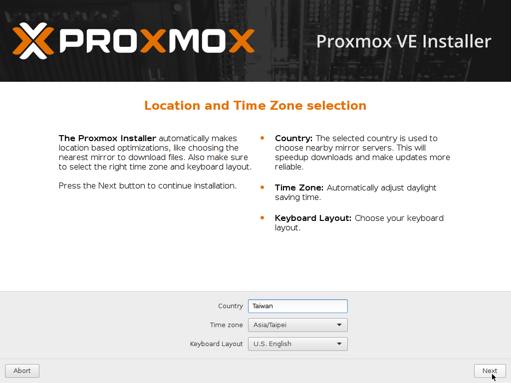
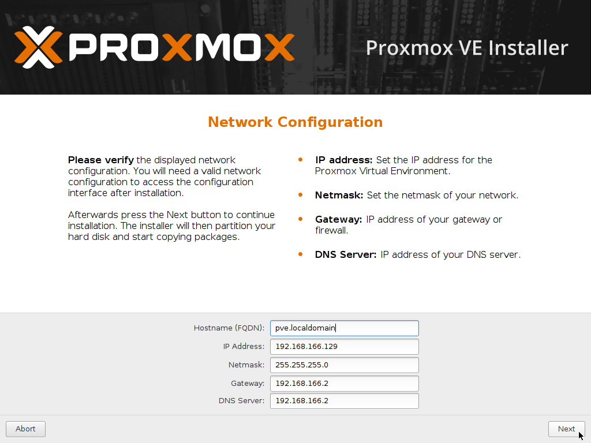
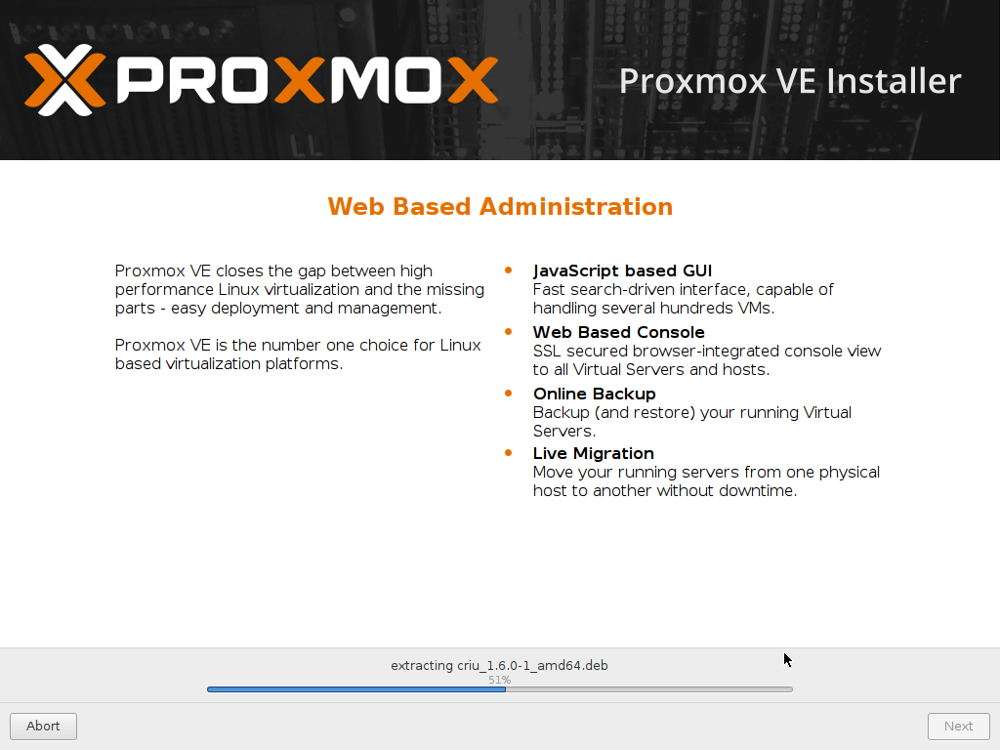
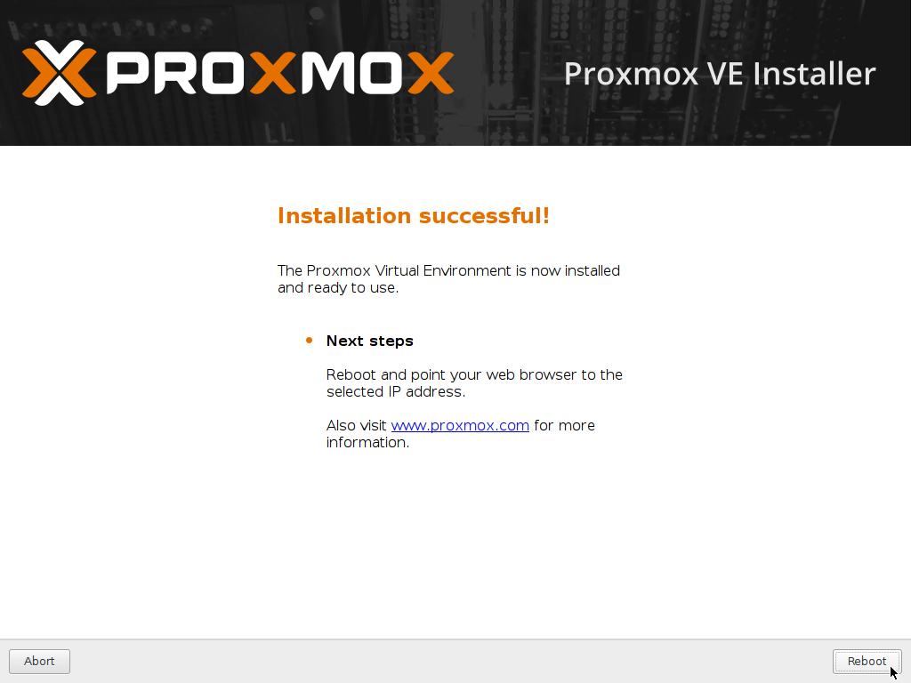

系統安裝(初階)
=

此為一般使用者的安裝方式，適合初學者學習使用。

- 使用 **USB開機碟** 進行開機：

    
      

- 同意使用條款

    
      

- 點擊 **Options** ，這邊我們選用 zfs 作為 rootfs

    
      

- 此範例中只有一個硬碟，所以選 Raid0 就可以了

    
      

- 壓縮模式選擇 **lz4** 較為快速，也吃比較少資源

    
      

- 時區、國家、語言設定，通常只會修改時間跟國家的選項
    
    
      

- 設定 root 的密碼以及管理者的 email 
    
    
      

- 設定 IP，請依照主機的網路環境進行修改
    
    
      

- 安裝中
    
    
      

- 安裝完畢，重新啟動
    
    
      

