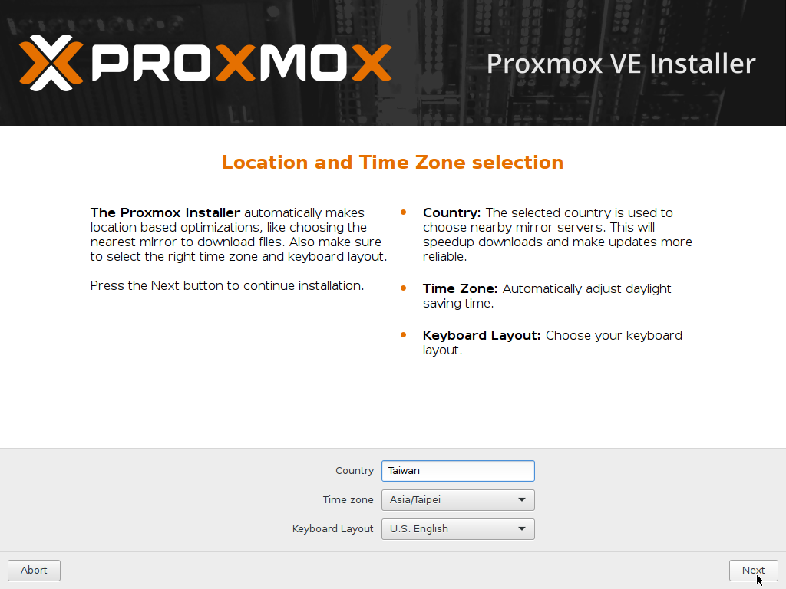

系統安裝
=
在開始前，需要先做一點準備才能開始安裝系統，
## 行前準備
首先準備以下的東西：
- USB 隨身碟*1 (安裝碟，**檔案將會清空，請做好備份**)
- [Proxmox VE ISO 映像檔](https://www.proxmox.com/en/downloads/category/iso-images-pve)

## 製作開機碟
-  Windows :
請下載安裝 [Win32 Disk Imager](https://sourceforge.net/projects/win32diskimager/files/latest/download) 來製作開機碟。

- Linux :
使用 dd 指令製作開機碟：
    - 首先使用 ```fdisk -l```找出你要製作成安裝碟的隨身碟代號後，使用以下指令製作：
        ```
        sudo dd if=proxmox-ve_4.4-eb2d6f1e-2.iso of=/dev/sdX
        ```
        
        若是想要查看 dd 進度，可以另外開一個命令視窗來查詢進度：
        ```
        watch -n 5 pkill -USR1 ^dd$
        ```

## 系統安裝
- 使用 **USB開機碟** 進行開機：
    

- 同意使用條款
    

- 點擊 **Options** ，這邊我們選用 zfs 作為 rootfs
    

- 此範例中只有一個硬碟，所以選 Raid0 就可以了
    

- 壓縮模式選擇 **lz4** 較為快速，也吃比較少資源
    

- 時區、國家、語言設定，通常只會修改時間跟國家的選項
    

- 設定 root 的密碼以及管理者的 email 
    

- 設定 IP，請依照主機的網路環境進行修改
    

- 安裝中
    
    
- 安裝完畢，重新啟動
    


