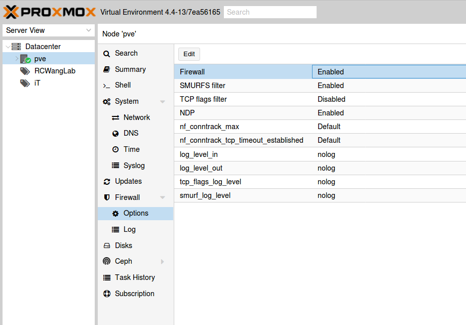
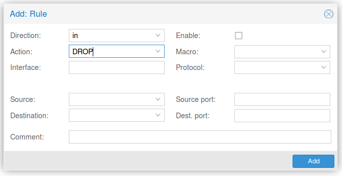
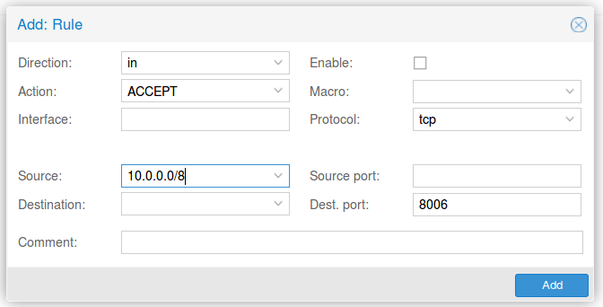

防火牆設定
=

在這邊只示範「丟棄(drop)」以及「允許(accept)」Proxmox VE 後台的方法。

## 啟用防火牆功能

- 首先請在最左側選擇你的 Proxmox VE Node 名稱，找到「Firewall」-> 「options」 檢查是否是 「Enable」狀態
    
    
    <br><br>

## 新增防火牆規則

- Drop All
    點擊左上方的「add」新增一個規則，設定如附圖，此設定用意為丟棄(drop)所有來自外部的封包，**請先不要把「Enable」打勾**

    
    <br><br>

- Accept
    點擊左上方的「add」新增一個規則，設定如附圖，允許來自「10.0.0.0/8」的 IP 進入 Proxmox VE 後台 ，**請先不要把「Enable」打勾**

    
    <br><br>

- Enable
    完成後，依照以下順序啟用防火牆規則

    1. Drop All
    2. Accept

- 過幾分鐘後試著 SSH 進主機，會發現機器沒有回應，這樣就是成功了
    
    ```
    ssh: connect to host pve.example.com port 22: Connection timed out
    ```
## 其他 Ports 
- 除了後台以外，還有其他的 Port 需要啟用，請依照自身需求調整
- 在 Proxmox VE 的 Wiki 中有寫道，其中有哪些服務需要打開哪些 Port，詳情請見 [Ports - Proxmox VE](https://pve.proxmox.com/wiki/Ports)
   

