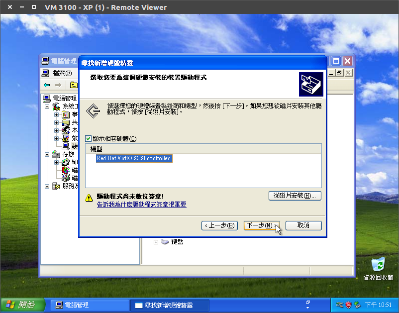
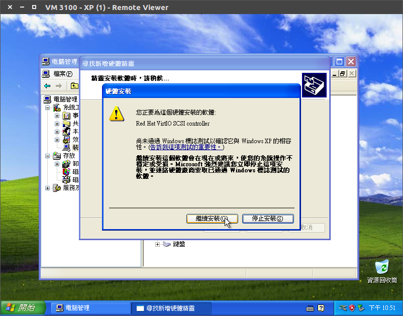

Windows XP
=

雖然微軟已經不支援 Windows XP 了，但是在某些環境仍然需要此系統，所以一併寫下。

## 新增虛擬機器

- 設定 VM ID 跟 VM 名稱

    
          

- 選擇 Windows XP

    
          

- ISO 映像擋

    
          

- 硬碟選擇「IDE」，這樣安裝程式才讀得到硬碟

    
          

- CPU 核心數自行調整，CPU 型號個人習慣使用 host 

    
          

- 記憶體自行調整

    
          

- 網卡請選 RTL8139 ， 不然會卡安裝

    
          

## 安裝作業系統

- 照一般電腦安裝 XP 的方式去安裝即可
    
    
          
- 裝好後關機

    
          

## VirtIO 驅動

因為 Windows XP 安裝的時候只抓的到 IDE 硬碟，現在裝完系統後就可以來安裝 VirtIO 的驅動程式了，之後再把硬碟、網卡改成 VirtIO 後就可以擁有 KVM 的最大效能了，關機新增一個光碟機掛載 VirtIO 的 ISO 。

      

### 新增 VirtIO 裝置

- 首先要先新增一個 VirtIO 的硬碟，容量 1GB 就好，裝好驅動後會移除。
   
    
          

- 將網卡修改為 VirtIO

    
          

### 安裝驅動

- 開機後會抓到裝置

    
          

- 從清單或特定位置安裝

    
          

- 不要搜尋，我將選擇要安裝的驅動程式

    
          

- 從磁片安裝

    
          

- 選擇相對應的驅動，下圖為安裝硬碟驅動

    
          

- 下一步

    
          

- 繼續安裝

    
          

- 完成

    
          

- 註：如果遇到需要選擇裝置類型的時候，隨便選就可以了，只要驅動選對即可

    
          

- 全數安裝完畢

    
          

### 移除硬碟

- 驅動裝好後，就可以把剛剛新增的 1GB 硬碟移除了

    
          

- **確認刪除，這步驟無法復原**

    
          

### 修改開機碟格式

因為已經裝好驅動了，所以 XP 已經讀得到 VirtIO 的硬碟且可以用來開機，這樣效能才會最好

- 首先需要先把硬碟 (ide0) 移除，之後再新增回來，並改為 VirtIO

    
          

- 點擊「Unused Disk 0」，把硬碟改為 VirtIO ，且 Cache 為 Write back 後新增

    
          

- 移除剛剛新增的光碟機，用不到了

    
          

### 修改開機選單

修改完畢後，需要去修正開機選單，否則系統會無法開機，到 「Option」 -> 「Boot Order」 ，把 「ide0」 改成 「virtio0」，這樣就可以開機了。

      

## 安裝 SPICE 驅動

在 Windows 的環境下，使用 SPICE 進行連線會有接近原生的體驗，所以需要安裝 [SPICE Driver](https://www.spice-space.org/download.html) 才會順暢。

      

# 測試影片

