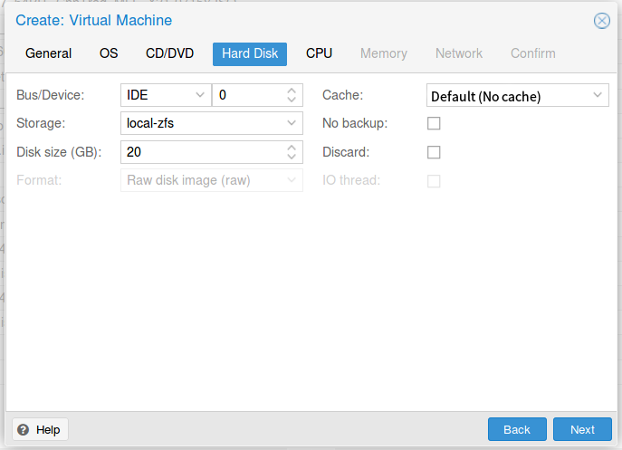

Windows XP
=

雖然微軟已經不支援 Windows XP 了，但是在某些環境仍然需要此系統，所以一併寫下。

## 新增虛擬機器

- 設定 VM ID 跟 VM 名稱

    
          

- 選擇 Windows XP

    
          

- ISO 映像擋

    
          

- 硬碟選擇「IDE」，快取為 「Write back」，這樣安裝程式才讀得到硬碟

    
          

- CPU 核心數自行調整，CPU 型號個人習慣使用 host 

    
          

- 記憶體自行調整

    
          

- 網路自行調整

    
          

## 安裝作業系統

照一般電腦的安裝即可
    

      

